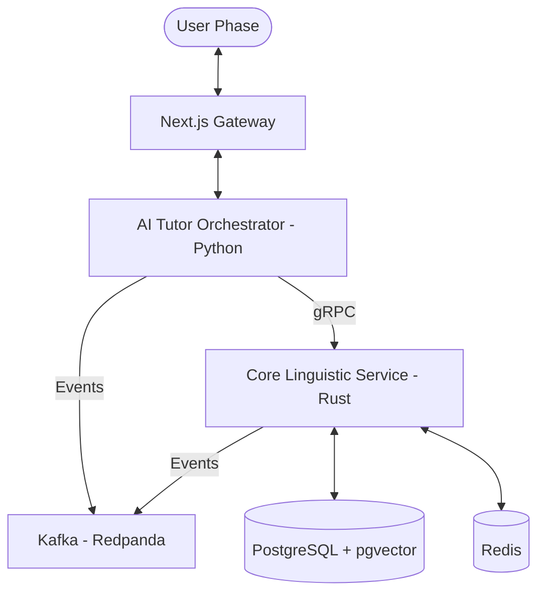

# Polyglot-Agent OS: Project Map

## Directory Structure

```text
polyglot-agent-os/
├── .agent/                     # Agent-specific configuration
│   ├── rules/                  # Workspace-level behavioral rules
│   │   ├── architecture.md      # Clean Architecture & Service rules
│   │   ├── documentation-standards.md # Sync & Project Map rules
│   │   ├── project-standards.md # Global dispatcher
│   │   ├── python-standards.md  # AI Tutor (Python) rules
│   │   └── rust-standards.md    # Core Linguistic (Rust) rules
│   └── workflows/              # Standard Operating Procedures (SOPs)
├── .gitignore                  # Git exclusion rules
├── AGENTS.md                   # Instructions for AI Agents
├── contracts/                  # gRPC & Protobuf definition
│   └── learning_service.proto  # Core contract (Linguistic & SRS)
├── docs/                       # Project documentation
│   ├── beads-integration-guide.md # Beads (bd) setup & usage
│   ├── mcp-config.md           # Model Context Protocol config
│   ├── project-map.md          # [YOU ARE HERE]
│   ├── rules.md                # Architecture & Coding rules
│   ├── skills.md               # Agent skills & tools definition
│   └── workflows.md            # Interaction patterns
├── infra/                      # Infrastructure as Code
│   ├── docker-compose.yml      # Orchestration (DB, Redis, Kafka, MinIO)
│   └── init-db.sql             # Database schema & Extensions
├── services/                   # Microservices
│   ├── ai-tutor/               # AI Orchestrator (Python/FastAPI)
│   │   ├── main.py             # Entry point (Bootstrap)
│   │   ├── agents/             # Domain: Specific LLM Agents
│   │   ├── workflows/          # Application: Orchestration logic
│   │   ├── infrastructure/     # Infrastructure: gRPC clients, Kafka
│   │   │   └── grpc_clients.py
│   │   └── presentation/       # Presentation: FastAPI routes
│   │       └── routes.py
│   └── core-linguistic/        # Learning Kernel (Rust/Tonic)
│       ├── Cargo.toml
│       ├── build.rs
│       └── src/
│           ├── main.rs         # Entry point (Bootstrap)
│           ├── lib.rs          # Module declarations
│           ├── domain/         # Domain: Entities & SRS logic
│           ├── application/    # Application: Use cases
│           ├── infrastructure/ # Infrastructure: Postgres, Kafka
│           └── presentation/   # Presentation: gRPC services
├── project_flow.md             # Vision & Roadmap
├── scripts/                    # Utility scripts
│   └── beads_0.47.1_windows_amd64/ # Local Beads (bd) binary & docs
└── shared/                     # Shared items/resources
```

## Service Communication



## Modules Responsibility

| Component | Language | Primary Responsibility |
|-----------|----------|------------------------|
| **Core Linguistic** | Rust | Tokenization, Han-Viet mapping, SRS logic |
| **AI Tutor** | Python | LLM integration, Workflow orchestration, NLP tasks |
| **Kafka** | Event Bus | Asynchronous task offloading (Audio, Heavy AI) |
| **PostgreSQL** | Database | Persistence & Semantic search (pgvector) |
| **MinIO** | S3 | Object storage for Audio/PDF files |
```
